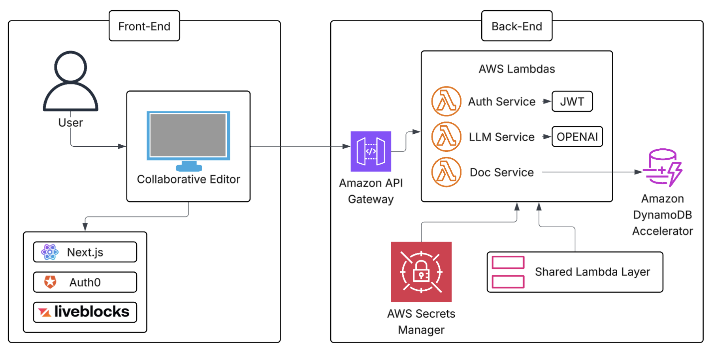

# 📝 AI-Powered Collaborative Editor

A deceptively simple collaborative editor powered by OpenAI APIs, enabling real-time grammar, tone, and style suggestions. While the interface is minimalist, the architecture is robust — featuring serverless deployment, AI prompt engineering, real-time collaboration, and secure authentication.

> 📘 **Note:** Full documentation is in progress. This file serves as a project summary and implementation snapshot.

---

# 🧱 AI-Powered Collaborative Editor

 <!-- Replace with actual path to your diagram -->

---

## 🚀 Technologies Used

### Languages
- TypeScript
- Node.js

### Frameworks & Libraries
- Next.js
- React
- Joy UI (Material UI)
- WebSocket

### Tools & Integrations
- **Liveblocks** – Real-time collaboration (WebSocket)
- **Webpack** – Bundling
- **Vercel** – Frontend deployment

### Authentication
- Auth0
- NextAuth (JWT-based)

### Databases
- Vercel PostgreSQL (User credentials)
- AWS DynamoDB (Document storage)

### AI / NLP
- OpenAI APIs via **Langchain**
- Prompt engineering for structured responses

### DevOps & Infrastructure
- Docker
- AWS SAM

### AWS Resources
- Lambda & Lambda Layers
- API Gateway
- DynamoDB
- Secrets Manager
- IAM Policies

---

## 🔐 Authentication

- Programmatic login using Auth0 and NextAuth.
- User credentials stored securely in **Vercel PostgreSQL**.
- Credentials validated via **Next.js server-side functions**.

---

## 🧠 Backend (AWS Lambda)

A modular backend powered by AWS Lambda and DynamoDB, adhering to the DRY principle by abstracting shared logic into services.

### Key Services

- **AuthService**
  - Validates requests using JWT tokens.
- **DocService**
  - Handles document save/load with DynamoDB.
- **LLMService**
  - Calls OpenAI APIs using Langchain.
  - Implements prompt engineering to return **structured, predictable responses** suitable for frontend consumption.

---

## 🎨 Frontend Overview

### CollaborativeEditor.tsx
- Wrapper for `Tiptap` rich text editor.
- Establishes Liveblocks WebSocket connection.
- Handles admin logic and user session.

### Suggestions.tsx
- Fetches grammar/tone/style suggestions from `llmSuggestionHandler` Lambda.
- Uses **debouncing** to limit API requests.
- Injects selected suggestion directly into the editor.

### Dashboard.tsx
- Organizes layout and major components.
- Loads/saves documents to `LocalStorage`.
- Uses unique `roomID` per document to scope collaboration.

### Sidebar.tsx
- Displays list of documents.
- Handles creation and deletion.

### LoginForm.tsx
- Manages programmatic login.
- Credentials validated server-side using NextAuth.

---

## ☁️ Infrastructure as Code

Deployed via **AWS SAM** with the following architecture:

- **Lambdas:** For auth, LLM interaction, and document operations.
- **Lambda Layers:** Package shared dependencies separately.
- **API Gateway:** Routes frontend requests to Lambda.
- **DynamoDB:** Stores document data.
- **Secrets Manager:** Stores API keys and tokens securely.
- **IAM Policies:** Grant fine-grained permissions.

---

## 📦 Build & CI/CD

- Uses Docker to create isolated Lambda Layers for shared libraries.
- Separates Lambda function code and dependencies to reduce cold start time and improve maintainability.

---

## ⚠️ Caveats & Work in Progress

- `DocService` (DynamoDB integration) is implemented but not yet fully integrated.
- Additional documentation is in progress.

---

## 🧠 Learnings

- Gained deep experience with **prompt engineering** for structured LLM output.
- Practiced **modular serverless architecture** and service abstraction.
- Leveraged real-time collaboration tools (Liveblocks) with state isolation.

---

## 📌 Techniques Highlighted

- Programmatic login with secure validation
- WebSocket-powered collaborative editing
- Structured LLM responses via Langchain
- Scalable serverless backend with AWS SAM
- Docker-based Lambda layer packaging

---

## 📬 Contact

For questions, ideas, or contributions, please feel free to reach out.

---
